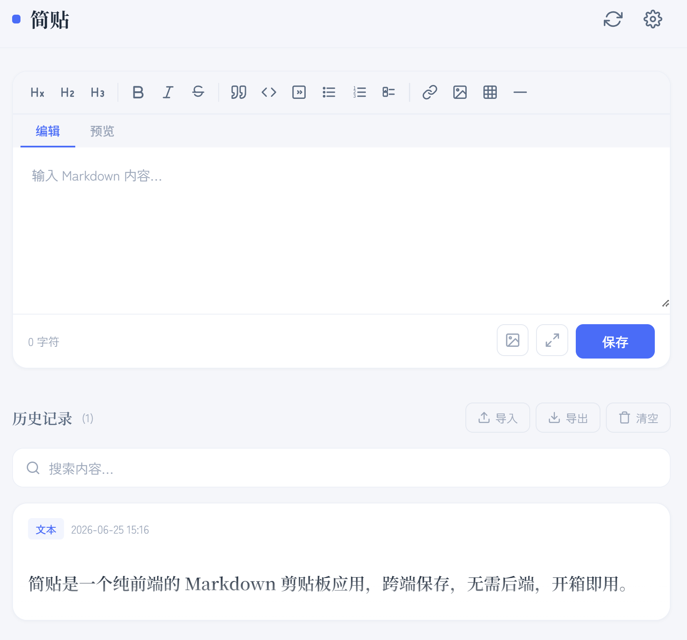

# 简贴

一个纯前端的 Markdown 剪贴板应用，跨端保存，无需后端，开箱即用。  

  

## 部署到 GitHub Pages

### 1. 创建仓库

将代码推送到 GitHub 仓库，确保仓库中包含 `index.html`。

### 2. 开启 GitHub Pages

1. 进入仓库 -> **Settings** -> **Pages**
2. **Source** 选择 `Deploy from a branch`
3. **Branch** 选择 `main`，目录选择 `/ (root)`
4. 点击 **Save**，等待几分钟即可通过 `https://<用户名>.github.io/<仓库名>/` 访问

### 3. 绑定自定义域名（Cloudflare）

以托管在 Cloudflare 上的域名为例：

**Cloudflare 端：**

1. 登录 [Cloudflare Dashboard](https://dash.cloudflare.com/)
2. 选择你的域名 -> **DNS** -> **Records**
3. 添加记录：
   - **类型**: `CNAME`
   - **名称**: 你想要的子域名（如 `notes`），或 `@` 表示根域名
   - **目标**: `<用户名>.github.io`
   - **代理状态**: 关闭（灰色云朵，DNS only）
4. 点击 **Save**

**GitHub 端：**

1. 进入仓库 -> **Settings** -> **Pages**
2. 在 **Custom domain** 中填入你的域名（如 `notes.example.com`）
3. 点击 **Save**，等待 DNS 验证通过
4. 验证成功后勾选 **Enforce HTTPS**

> 如果使用根域名，Cloudflare 端的记录类型选 `A`，目标填入 GitHub Pages 的 IP 地址（可在 [GitHub 文档](https://docs.github.com/en/pages/configuring-a-custom-domain-for-your-github-pages-site/managing-a-custom-domain-for-your-github-pages-site) 中查找）。

## 配置 GitHub Gist 同步

同步功能通过 GitHub Gist 实现，需要一个 Personal Access Token。

### 步骤

1. 访问 [GitHub Settings -> Personal access tokens](https://github.com/settings/tokens)
2. 点击 **Generate new token (classic)**
3. 填写备注，勾选 **gist** 权限
4. 点击 **Generate token**，复制生成的 token（`ghp_` 开头）

### 在简贴中配置

1. 点击右上角设置按钮
2. **同步模式** 选择 `文本同步` 或 `文本 + 图片同步`
3. 在 **GitHub Gist** 区域：
   - 粘贴你的 **Personal Access Token**
   - **Gist ID** 留空，首次同步时会自动创建
4. 点击 **测试连接** 验证配置
5. 点击 **保存设置**

配置完成后，点击顶部同步按钮即可在多台设备间同步笔记。

## 配置兰空图床 (Lsky Pro)

兰空图床用于在 `文本 + 图片同步` 模式下将图片上传到外部存储。

### 获取 Token

1. 登录你的兰空图床后台
2. 进入 **接口认证** 页面
3. 复制 Token（格式为 `Bearer xxxxxxxx`）

### 在简贴中配置

1. 点击右上角设置按钮
2. **同步模式** 选择 `文本 + 图片同步`
3. 在 **兰空图床** 区域：
   - 填入 **图床地址**（如 `https://image.example.com`）
   - 粘贴 **Token**
4. 点击 **测试连接** 验证配置
5. 点击 **保存设置**

## License

[MIT](LICENSE)
